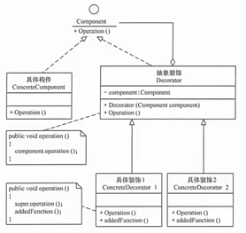
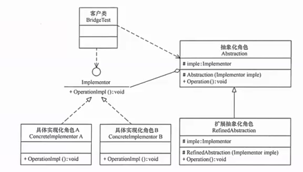
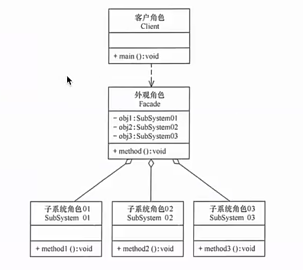
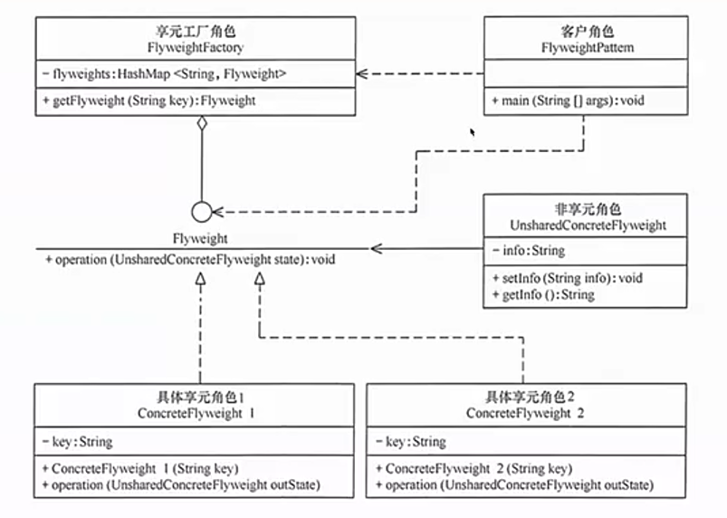
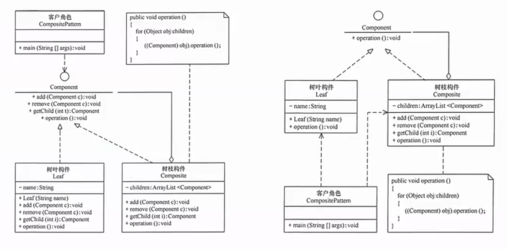
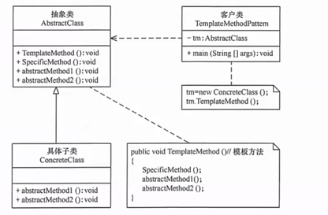
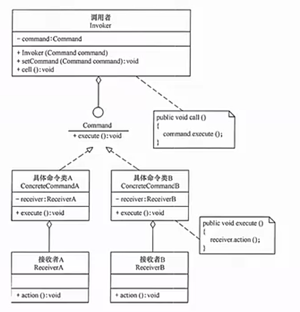

# 设计模式
本仓库是设计模式示例代码仓库
## 简单工厂设计模式
simplefactory 
 
## 策略模式
strategy 
 
## 单例模式
singleton 
 
可参考文章：https://zhuanlan.zhihu.com/p/677327799 
## 代理模式
proxy 
  
## 原型模式
prototype 
原型模式，可以理解为克隆，基于某对象复制一份新的对象 
优点： 
1. 基于内存二进制流拷贝，性能比新建对象好 
2. 可使用深克隆的方式，保存对象的状态，简化创建对象的过程，或者实现撤销的操作 
缺点： 
1. 需要给每个类都实现clone方法，也违背了开闭原则  
2. java支持浅克隆，但是深克隆时，每层对象都需要支持深克隆  
类结构图 
 

## 适配器模式
adapter 
适配器模式：将一个类的接口转换为客户希望的另外的一个接口 
优点： 
1. 让原本的接口不兼容、不能一起工作的类可以一起工作，可以透明的调用目标接口  
2. 重用、复用适配器类，不用修改原先的代码 
3. 目标类和适配器类解耦 
缺点：
1. 编写的过程需要结合业务，系统的复杂性高 
2. 降低代码可读性 
类结构适配器模式图（耦合度要比对象的高，需要知道组件库中的内部结构） 
 
对象结构适配器模式图（一般采用这种模式） 
 

## 装饰模式
Decorator Pattern 
装饰模式：在不改变现有对象结构的情形下，动态的给一个对象去扩展功能，做到即插即用 
优点： 
1. 在不改变现有对象结构的情形下，动态的给一个对象去扩展功能 
2. 通过使用不同的装饰类、装饰类排列组合，实现不同的效果 
3. 完全遵守排列组合 
缺点： 
1. 增加了很多子类，增加程序的复杂性 
类结构图 
    

## 桥接模式
Bridge Pattern
桥接模式：将抽象和实现做一个完整的分离，能够让他们独立变化，降低耦合性 
优点： 
1. 抽象和实现分离，扩展能力强 
2. 符合开闭原则 
3. 符合合成复用原则 
4. 实现细节对客户透明 
缺点： 
1. 要求开发者正确识别系统中两个变化的维度，要求开发者对业务需求、要求的理解度有高要求 
类结构图 
 
   
## 外观模式
Facade  
外观模式：封装底层接口，提供统一的接口 
优点： 
1. 迪米特法则的典型应用，让客户端和子系统的耦合度 
2. 对客户端屏蔽了子系统的组件，对客户端来说也减少了对象的数量 
3. 减少了客户端编译依赖性 
缺点： 
1. 无法很好的限制使用子系统的类 
2. 增加子系统时，依旧需要修改外观类，违背了开闭原则 
类结构图 
 

## 享元模式
Flyweight 
创建大量的对象，存在资源的消耗，这也是一个优化点，如果把相同的部分提取出来共享，也是可以提升性能的 
内部状态：对象共享出来的信息，存在享元信息的内部，不会随环境的变化而变化 
外部状态： 对象依赖的标记，随环境的变化而变化 
如连接池：数据库用户名是内部状态；连接状态为外部状态 
优点： 
1. 用共享技术较少对象的创建，增加对象的复用，相同对象只需要保存一份，减少对象的创建，减轻内存的压力 
缺点： 
1. 需要将外部状态抽离处理，增加系统的复杂度 
2. 系统的运行会变得更长 
类结构图 
 

## 组合模式
Composite 
优点： 
1. 让客户端一致的处理单个对象和组合对象，无需关心是处理组合对象还是单个对象，减少了代码 
2. 满足开闭原则 
缺点： 
1. 设计比较复杂  
2. 限制构件比较麻烦 
3. 继承麻烦 
类结构图 
左图为“透明模式”，右图为“安全模式”，左图叶子节点有“增删操作”  
 
   
## 模板方法模式
TemplateMethod
模板方法模式：定义了一个算法的步骤，允许子类在不改变算法结构的基础上重新定义算法中的某些步骤。 
如人的一天：银行工作人员，上班打卡，存取前；程序员，上班打卡，写代码 
优点： 
1. 封装了不变的部分（封装在父类中），扩展了可变的部分（子类继承去实现）  
2. 父类提取了公共代码，提高代码复用 
3. 子类去扩展，满足了开闭原则 
缺点： 
1. 每个不同的实现都需要定义不同的子类，增加系统实现的复杂度  
2. 父类的抽象方法，是由子类去实现的，子类的执行结果影响了父类结果，是反向的结构，提高代码阅读的难度 
3. 由于继承，父类添加方法，子类都需要去改一遍 
类结构图  
 
   
## 命令模式
Command 
命令模式：方法的请求者和实现者有紧密的耦合，如对某个方法进行撤销，如遥控器。
将一个请求封装为一个对象，让发出请求的责任和处理请求的责任进行分隔，通过命令对象进行分割、管理等。 
优点： 
1. 降低系统的耦合性 
2. 扩展性好，可以很好的实现，可以和组合模式一起使用，封装为一个组合命令 
缺点： 
1. 每个具体的操作都需要设计一个命令类，增加整个系统的复杂度 
2. 命令模式的结果（执行方的结果），使用命令的形式架构，在理解上增加了难度 
类结构图  
 