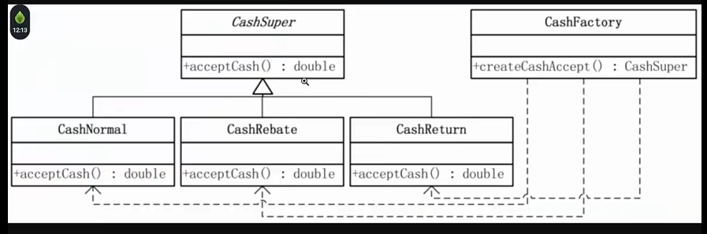
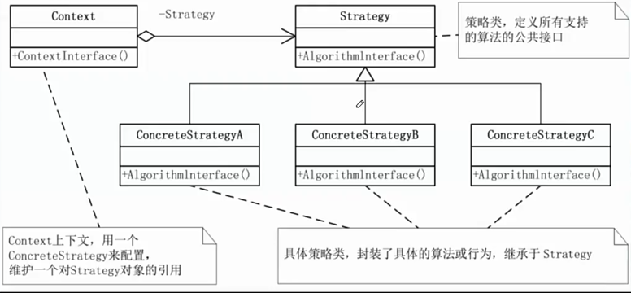
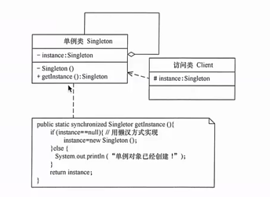
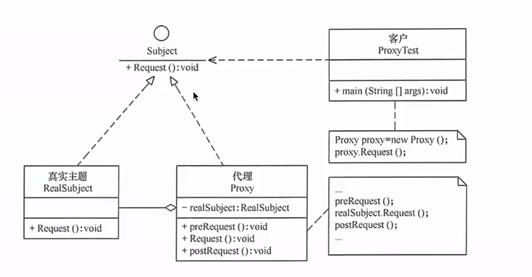
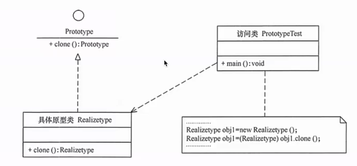
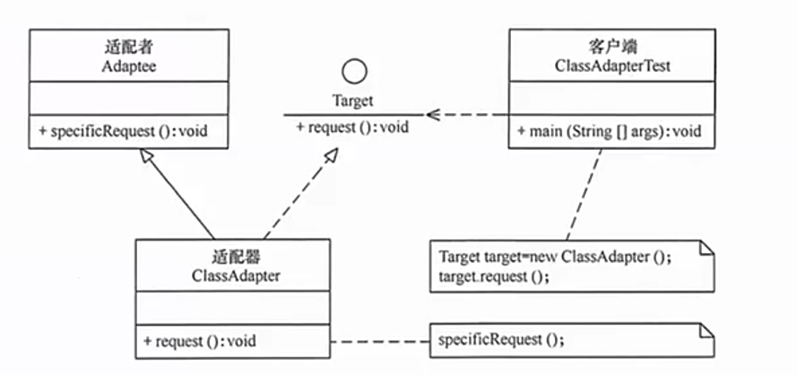
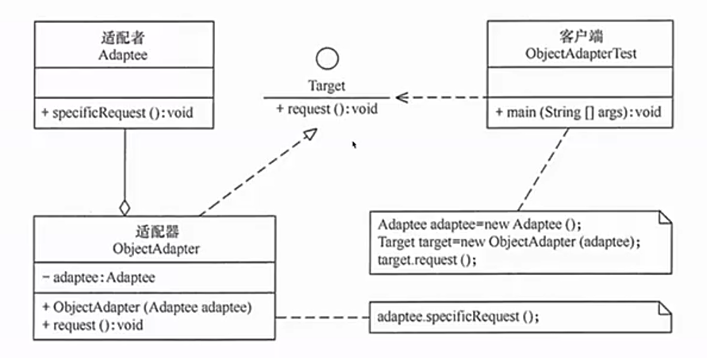

# 设计模式
本仓库是设计模式示例代码仓库
## 简单工厂设计模式
simplefactory 
 
## 策略模式
strategy 
 
## 单例模式
singleton 
 
## 代理模式
proxy 
  
## 原型模式
prototype 
原型模式，可以理解为克隆，基于某对象复制一份新的对象 
优点： 
1. 基于内存二进制流拷贝，性能比新建对象好 
2. 可使用深克隆的方式，保存对象的状态，简化创建对象的过程，或者实现撤销的操作 
缺点： 
1. 需要给每个类都实现clone方法，也违背了开闭原则  
2. java支持浅克隆，但是深克隆时，每层对象都需要支持深克隆  
类结构图 
 

## 适配器模式
adapter 
适配器模式：将一个类的接口转换为客户希望的另外的一个接口 
优点： 
1. 让原本的接口不兼容、不能一起工作的类可以一起工作，可以透明的调用目标接口  
2. 重用、复用适配器类，不用修改原先的代码 
3. 目标类和适配器类解耦 
缺点：
1. 编写的过程需要结合业务，系统的复杂性高 
2. 降低代码可读性 
类结构适配器模式图（耦合度要比对象的高，需要知道组件库中的内部结构） 
 
对象结构适配器模式图（一般采用这种模式） 
 